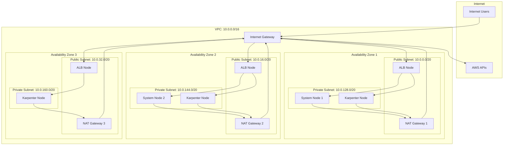
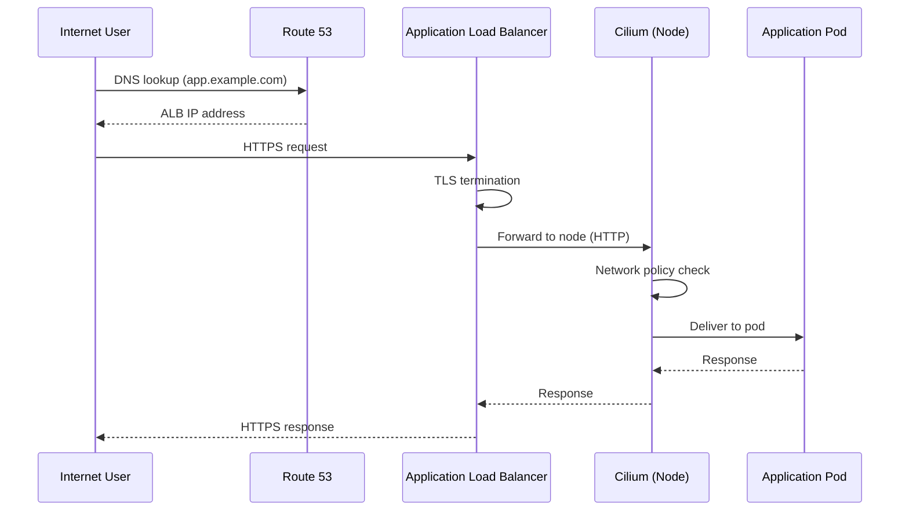
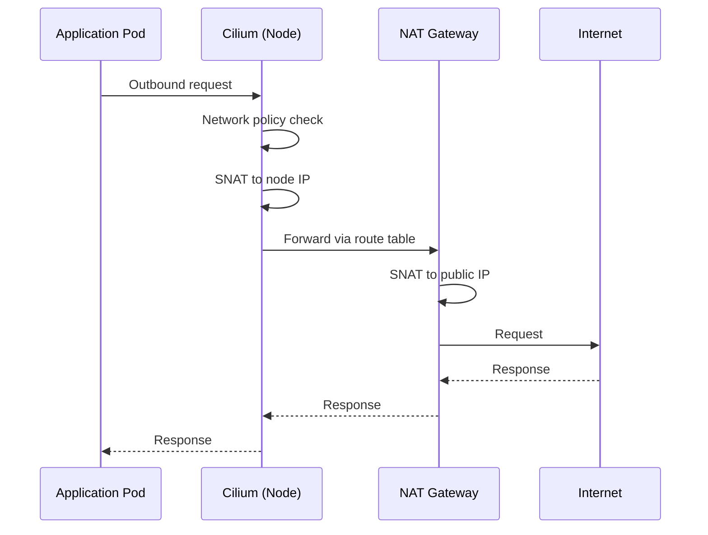
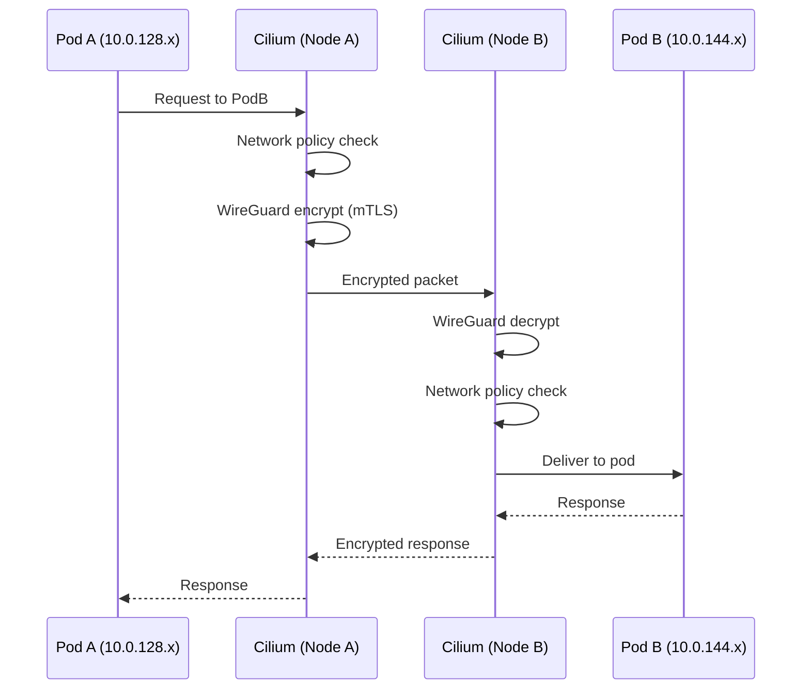
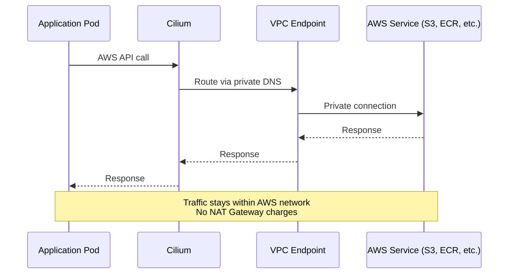
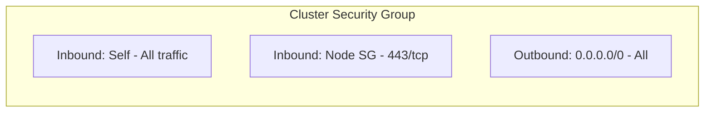
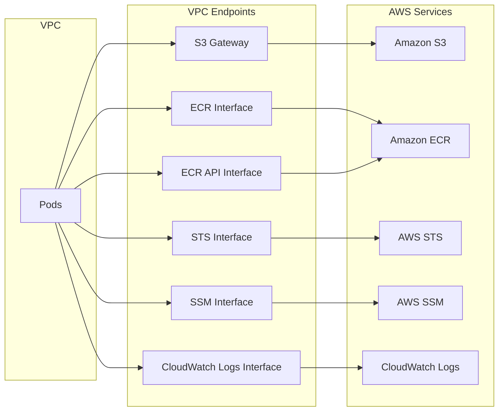
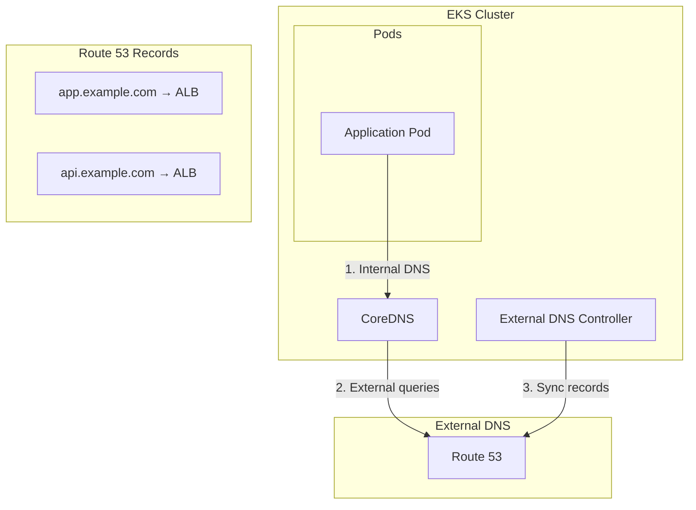

# Network Topology

Detailed network architecture diagrams for the AWS EKS infrastructure.

## VPC Architecture



## Subnet Layout

| Subnet Type | AZ | CIDR Block | Size | Purpose |
|-------------|-----|------------|------|---------|
| Public | 1 | 10.0.0.0/20 | 4,096 IPs | NAT Gateway, ALB |
| Public | 2 | 10.0.16.0/20 | 4,096 IPs | NAT Gateway, ALB |
| Public | 3 | 10.0.32.0/20 | 4,096 IPs | NAT Gateway, ALB |
| Private | 1 | 10.0.128.0/20 | 4,096 IPs | EKS Nodes, Pods |
| Private | 2 | 10.0.144.0/20 | 4,096 IPs | EKS Nodes, Pods |
| Private | 3 | 10.0.160.0/20 | 4,096 IPs | EKS Nodes, Pods |

**Reserved ranges:** 10.0.48.0/20 - 10.0.112.0/20 for future use (isolated subnets, additional environments).

## Traffic Flows

### Ingress Flow (External to Pod)



### Egress Flow (Pod to Internet)



### Pod-to-Pod Flow (Same Cluster)



### AWS API Flow (via VPC Endpoints)



## Security Groups

### Cluster Security Group



| Direction | Port | Protocol | Source/Dest | Purpose |
|-----------|------|----------|-------------|---------|
| Inbound | All | All | Self | Cluster internal |
| Inbound | 443 | TCP | Node SG | API server access |
| Outbound | All | All | 0.0.0.0/0 | Internet access |

### Node Security Group

| Direction | Port | Protocol | Source/Dest | Purpose |
|-----------|------|----------|-------------|---------|
| Inbound | All | All | Self | Node-to-node |
| Inbound | All | All | Cluster SG | From control plane |
| Inbound | 443 | TCP | ALB SG | Webhook callbacks |
| Inbound | 10250 | TCP | Cluster SG | Kubelet API |
| Outbound | All | All | 0.0.0.0/0 | Internet access |

### ALB Security Group

| Direction | Port | Protocol | Source/Dest | Purpose |
|-----------|------|----------|-------------|---------|
| Inbound | 80 | TCP | 0.0.0.0/0 | HTTP (redirect) |
| Inbound | 443 | TCP | 0.0.0.0/0 | HTTPS |
| Outbound | All | All | Node SG | To nodes |

## VPC Endpoints

VPC endpoints provide private connectivity to AWS services:



| Endpoint | Type | Service | Purpose |
|----------|------|---------|---------|
| S3 | Gateway | com.amazonaws.region.s3 | Loki, Tempo, Velero storage |
| ECR DKR | Interface | com.amazonaws.region.ecr.dkr | Container image pulls |
| ECR API | Interface | com.amazonaws.region.ecr.api | ECR API calls |
| STS | Interface | com.amazonaws.region.sts | IRSA token exchange |
| SSM | Interface | com.amazonaws.region.ssm | Systems Manager |
| Logs | Interface | com.amazonaws.region.logs | CloudWatch Logs |

## DNS Architecture



### DNS Resolution Flow

1. **Cluster-internal names** (e.g., `service.namespace.svc.cluster.local`):
   - Resolved by CoreDNS directly
   - No external DNS query

2. **External names** (e.g., `api.example.com`):
   - CoreDNS forwards to Route 53 resolver
   - Cached according to TTL

3. **AWS service endpoints** (e.g., `s3.us-west-2.amazonaws.com`):
   - Resolved to VPC endpoint private IPs
   - Via Route 53 Resolver inbound endpoint

## Network Policies

### Default Deny (Recommended)

```yaml
apiVersion: cilium.io/v2
kind: CiliumNetworkPolicy
metadata:
  name: default-deny
  namespace: production
spec:
  endpointSelector: {}
  ingress:
  - {}
  egress:
  - {}
```

### Allow DNS

```yaml
apiVersion: cilium.io/v2
kind: CiliumNetworkPolicy
metadata:
  name: allow-dns
  namespace: production
spec:
  endpointSelector: {}
  egress:
  - toEndpoints:
    - matchLabels:
        k8s:io.kubernetes.pod.namespace: kube-system
        k8s-app: kube-dns
    toPorts:
    - ports:
      - port: "53"
        protocol: UDP
      - port: "53"
        protocol: TCP
```

### Allow Ingress from ALB

```yaml
apiVersion: cilium.io/v2
kind: CiliumNetworkPolicy
metadata:
  name: allow-alb-ingress
  namespace: production
spec:
  endpointSelector:
    matchLabels:
      app: web
  ingress:
  - fromEntities:
    - world
    toPorts:
    - ports:
      - port: "8080"
        protocol: TCP
```

## Environment Variations

| Component | Dev | Staging | Production |
|-----------|-----|---------|------------|
| NAT Gateways | 1 (single AZ) | 2 (multi-AZ) | 3 (all AZs) |
| VPC Endpoints | S3 only | All | All |
| Flow Logs | Disabled | Enabled | Enabled |
| Public API Endpoint | Yes | Yes | No |
| WireGuard Encryption | Yes | Yes | Yes |

## Related Documentation

- [Architecture Overview](./overview.md)
- [Networking Architecture](./networking.md)
- [Security Architecture](./security.md)
