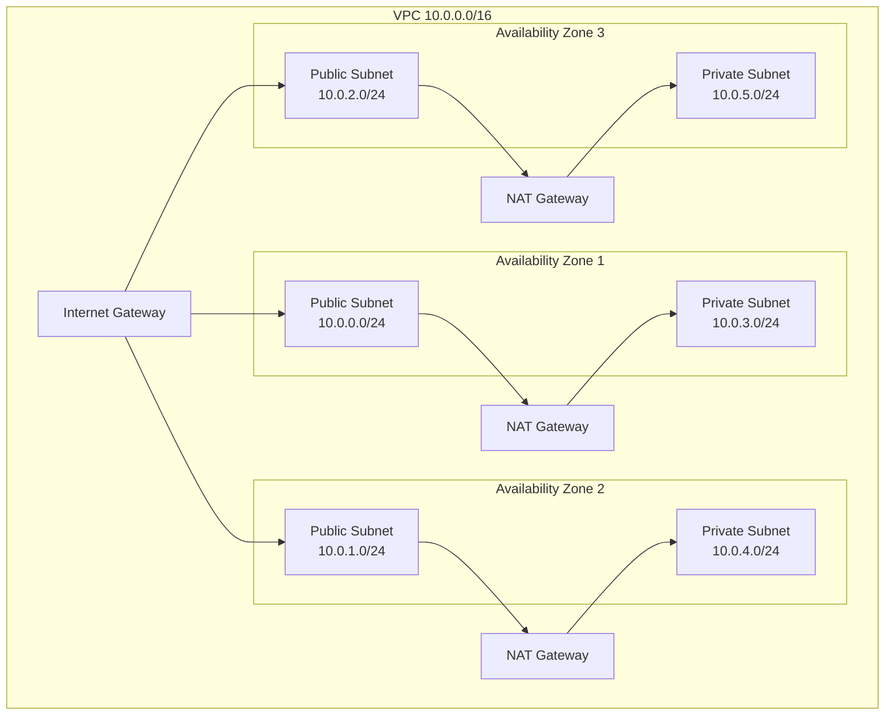
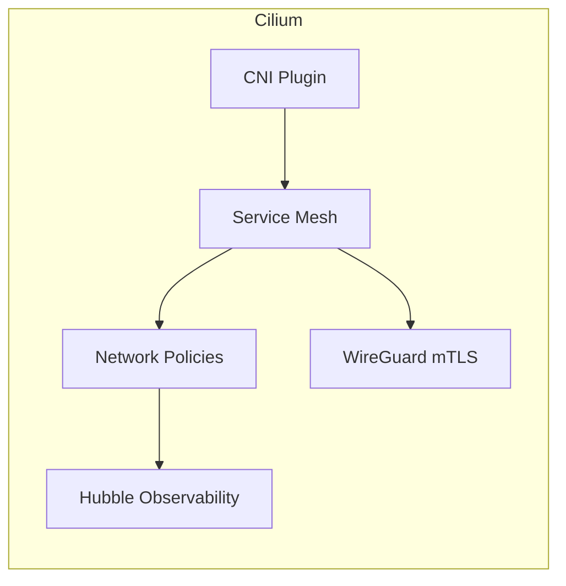
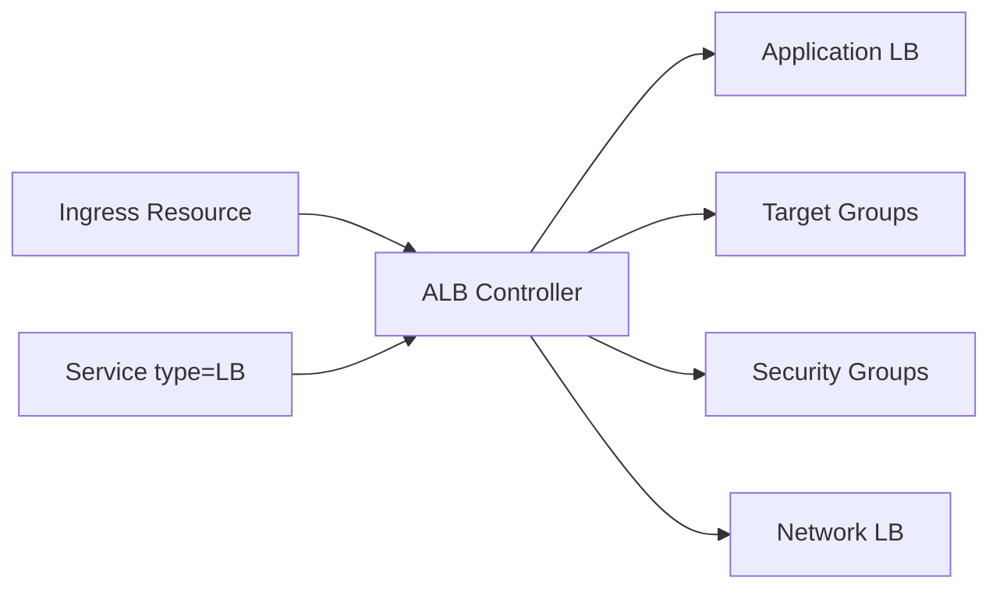
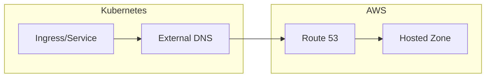

# Networking Architecture

This document describes the networking architecture of the AWS EKS infrastructure.

## VPC Design



### Subnet Configuration

| Subnet Type | CIDR Mask | Purpose |
|-------------|-----------|---------|
| Public | /24 | NAT Gateways, Load Balancers |
| Private | /24 | EKS Nodes, Pods |

### Subnet Tags

Subnets are tagged for automatic discovery:

```yaml
# Public Subnets
kubernetes.io/role/elb: "1"
kubernetes.io/cluster/{cluster-name}: "shared"
karpenter.sh/discovery: "{cluster-name}"

# Private Subnets
kubernetes.io/role/internal-elb: "1"
kubernetes.io/cluster/{cluster-name}: "shared"
karpenter.sh/discovery: "{cluster-name}"
```

## Cilium CNI

Cilium replaces the default AWS VPC CNI with enhanced features:

### Operating Mode

- **IPAM Mode**: ENI (uses AWS Elastic Network Interfaces)
- **Tunnel Mode**: Disabled (native routing)
- **Egress Masquerade**: eth0

### Features



#### 1. Network Policies

Cilium provides Kubernetes NetworkPolicy support plus extended CiliumNetworkPolicy:

```yaml
apiVersion: cilium.io/v2
kind: CiliumNetworkPolicy
metadata:
  name: allow-frontend
spec:
  endpointSelector:
    matchLabels:
      app: backend
  ingress:
  - fromEndpoints:
    - matchLabels:
        app: frontend
    toPorts:
    - ports:
      - port: "8080"
```

#### 2. WireGuard Encryption

All pod-to-pod traffic is encrypted using WireGuard:

```yaml
encryption:
  enabled: true
  type: wireguard
```

#### 3. Hubble Observability

Provides deep network visibility:

- **Flow Logs**: L3/L4/L7 traffic flows
- **Metrics**: DNS, TCP, HTTP, drop rates
- **UI**: Visual network flow graph

### Hubble Metrics

Collected metrics include:
- `dns` - DNS query/response metrics
- `drop` - Packet drop reasons
- `tcp` - TCP connection metrics
- `flow` - Network flow counts
- `port-distribution` - Port usage patterns
- `icmp` - ICMP traffic metrics
- `httpV2` - HTTP request/response metrics with exemplars

## AWS Load Balancer Controller

Manages AWS ALB/NLB resources for Kubernetes Services and Ingresses.

### Architecture



### IRSA Permissions

The controller uses IAM Roles for Service Accounts (IRSA):

```yaml
ServiceAccount: aws-load-balancer-controller
Namespace: kube-system
Permissions:
  - elasticloadbalancing:*
  - ec2:Describe*
  - ec2:CreateSecurityGroup
  - ec2:AuthorizeSecurityGroupIngress
  - acm:DescribeCertificate
  - wafv2:*
```

### Ingress Example

```yaml
apiVersion: networking.k8s.io/v1
kind: Ingress
metadata:
  name: my-app
  annotations:
    alb.ingress.kubernetes.io/scheme: internet-facing
    alb.ingress.kubernetes.io/target-type: ip
    alb.ingress.kubernetes.io/certificate-arn: arn:aws:acm:...
spec:
  ingressClassName: alb
  rules:
  - host: app.example.com
    http:
      paths:
      - path: /
        pathType: Prefix
        backend:
          service:
            name: my-app
            port:
              number: 80
```

## External DNS

Automatically manages Route 53 DNS records for Services and Ingresses.

### Architecture



### Configuration

```yaml
provider: aws
domainFilters:
  - example.com
txtOwnerId: {cluster-name}
policy: sync  # Create and delete records
```

### IRSA Permissions

```yaml
ServiceAccount: external-dns
Namespace: external-dns
Permissions:
  - route53:ChangeResourceRecordSets
  - route53:ListHostedZones
  - route53:ListResourceRecordSets
```

## Network Traffic Patterns

### East-West Traffic (Pod to Pod)

```
Pod A ──► Cilium ──► [WireGuard Encrypted] ──► Cilium ──► Pod B
              │                                    │
              └────── Network Policy Check ────────┘
```

### North-South Traffic (External to Pod)

```
Internet ──► ALB ──► Target Group ──► Pod IP
                          │
                          └── Health Checks
```

### Egress Traffic (Pod to Internet)

```
Pod ──► Cilium ──► [Network Policy] ──► ENI ──► NAT Gateway ──► Internet
```

## VPC Flow Logs

When enabled (`network.flowLogs: true`), VPC Flow Logs capture:

- Source/destination IP addresses
- Source/destination ports
- Protocol
- Packets/bytes transferred
- Action (ACCEPT/REJECT)

Flow logs are sent to CloudWatch Logs for analysis.

## Environment Differences

| Feature | Dev | Staging | Production |
|---------|-----|---------|------------|
| NAT Gateways | 1 | 2 | 3 |
| VPC Flow Logs | ✅ | ✅ | ✅ |
| Multi-AZ NAT | ❌ | ✅ | ✅ |
| Hubble UI | ✅ | ✅ | ✅ |

## Security Considerations

### Network Segmentation

- Public subnets: Only for load balancers and NAT gateways
- Private subnets: All EKS nodes and pods
- No direct internet access to pods

### Default Deny

Recommended to implement default-deny network policies:

```yaml
apiVersion: networking.k8s.io/v1
kind: NetworkPolicy
metadata:
  name: default-deny-all
  namespace: production
spec:
  podSelector: {}
  policyTypes:
  - Ingress
  - Egress
```

### Security Groups

- EKS Cluster security group: Controls control plane access
- Node security groups: Controls node-to-node communication
- ALB security groups: Created automatically by ALB Controller

## Ingress Patterns

This section documents recommended ingress patterns for different use cases.

### Pattern 1: Public Web Application

For internet-facing applications with TLS termination at the ALB:

```yaml
apiVersion: networking.k8s.io/v1
kind: Ingress
metadata:
  name: public-web-app
  annotations:
    # ALB configuration
    alb.ingress.kubernetes.io/scheme: internet-facing
    alb.ingress.kubernetes.io/target-type: ip
    alb.ingress.kubernetes.io/listen-ports: '[{"HTTPS":443}]'
    alb.ingress.kubernetes.io/ssl-redirect: '443'

    # TLS configuration
    alb.ingress.kubernetes.io/certificate-arn: arn:aws:acm:region:account:certificate/xxx
    alb.ingress.kubernetes.io/ssl-policy: ELBSecurityPolicy-TLS13-1-2-2021-06

    # Security
    alb.ingress.kubernetes.io/wafv2-acl-arn: arn:aws:wafv2:region:account:regional/webacl/xxx

    # Health checks
    alb.ingress.kubernetes.io/healthcheck-path: /health
    alb.ingress.kubernetes.io/healthcheck-interval-seconds: '15'
    alb.ingress.kubernetes.io/healthcheck-timeout-seconds: '5'
    alb.ingress.kubernetes.io/healthy-threshold-count: '2'
    alb.ingress.kubernetes.io/unhealthy-threshold-count: '3'
spec:
  ingressClassName: alb
  rules:
  - host: app.example.com
    http:
      paths:
      - path: /
        pathType: Prefix
        backend:
          service:
            name: web-app
            port:
              number: 80
```

### Pattern 2: Internal API Gateway

For internal services accessed only within the VPC:

```yaml
apiVersion: networking.k8s.io/v1
kind: Ingress
metadata:
  name: internal-api
  annotations:
    alb.ingress.kubernetes.io/scheme: internal
    alb.ingress.kubernetes.io/target-type: ip
    alb.ingress.kubernetes.io/listen-ports: '[{"HTTPS":443}]'
    alb.ingress.kubernetes.io/certificate-arn: arn:aws:acm:region:account:certificate/xxx
    alb.ingress.kubernetes.io/healthcheck-path: /health

    # Internal load balancer tags
    alb.ingress.kubernetes.io/tags: Environment=production,Team=platform
spec:
  ingressClassName: alb
  rules:
  - host: api.internal.example.com
    http:
      paths:
      - path: /v1
        pathType: Prefix
        backend:
          service:
            name: api-gateway
            port:
              number: 8080
```

### Pattern 3: gRPC Services

For gRPC services requiring HTTP/2:

```yaml
apiVersion: networking.k8s.io/v1
kind: Ingress
metadata:
  name: grpc-service
  annotations:
    alb.ingress.kubernetes.io/scheme: internal
    alb.ingress.kubernetes.io/target-type: ip
    alb.ingress.kubernetes.io/backend-protocol: GRPC
    alb.ingress.kubernetes.io/listen-ports: '[{"HTTPS":443}]'
    alb.ingress.kubernetes.io/certificate-arn: arn:aws:acm:region:account:certificate/xxx

    # gRPC health check
    alb.ingress.kubernetes.io/healthcheck-protocol: GRPC
    alb.ingress.kubernetes.io/healthcheck-path: /grpc.health.v1.Health/Check
spec:
  ingressClassName: alb
  rules:
  - host: grpc.internal.example.com
    http:
      paths:
      - path: /
        pathType: Prefix
        backend:
          service:
            name: grpc-service
            port:
              number: 50051
```

### Pattern 4: Path-Based Routing (Microservices)

For routing to multiple backend services based on URL path:

```yaml
apiVersion: networking.k8s.io/v1
kind: Ingress
metadata:
  name: microservices-gateway
  annotations:
    alb.ingress.kubernetes.io/scheme: internet-facing
    alb.ingress.kubernetes.io/target-type: ip
    alb.ingress.kubernetes.io/listen-ports: '[{"HTTPS":443}]'
    alb.ingress.kubernetes.io/certificate-arn: arn:aws:acm:region:account:certificate/xxx
    alb.ingress.kubernetes.io/wafv2-acl-arn: arn:aws:wafv2:region:account:regional/webacl/xxx

    # Stickiness for stateful services
    alb.ingress.kubernetes.io/target-group-attributes: stickiness.enabled=true,stickiness.lb_cookie.duration_seconds=3600
spec:
  ingressClassName: alb
  rules:
  - host: api.example.com
    http:
      paths:
      - path: /users
        pathType: Prefix
        backend:
          service:
            name: user-service
            port:
              number: 8080
      - path: /orders
        pathType: Prefix
        backend:
          service:
            name: order-service
            port:
              number: 8080
      - path: /products
        pathType: Prefix
        backend:
          service:
            name: product-service
            port:
              number: 8080
```

### Pattern 5: WebSocket Support

For applications requiring WebSocket connections:

```yaml
apiVersion: networking.k8s.io/v1
kind: Ingress
metadata:
  name: websocket-app
  annotations:
    alb.ingress.kubernetes.io/scheme: internet-facing
    alb.ingress.kubernetes.io/target-type: ip
    alb.ingress.kubernetes.io/listen-ports: '[{"HTTPS":443}]'
    alb.ingress.kubernetes.io/certificate-arn: arn:aws:acm:region:account:certificate/xxx

    # WebSocket configuration
    alb.ingress.kubernetes.io/load-balancer-attributes: idle_timeout.timeout_seconds=3600
    alb.ingress.kubernetes.io/target-group-attributes: stickiness.enabled=true
spec:
  ingressClassName: alb
  rules:
  - host: ws.example.com
    http:
      paths:
      - path: /ws
        pathType: Prefix
        backend:
          service:
            name: websocket-server
            port:
              number: 8080
```

### Ingress Validation

All Ingress resources should be validated against the OPA policies in `policies/networking.rego`:

```bash
# Validate ingress manifests
conftest test manifests/ingress.yaml --policy policies/networking.rego

# Example validation checks:
# - TLS required for production namespaces
# - Approved ingress classes only (alb, nginx, cilium)
# - Hosts must be in allowed domains
# - WAF required for internet-facing ALBs
# - Sensitive paths (/admin, /metrics, etc.) blocked
```

### Best Practices

1. **Always use TLS** - Configure TLS termination at the ALB or use end-to-end encryption
2. **Enable WAF** - Use AWS WAF for internet-facing applications
3. **Use IP target type** - Prefer `target-type: ip` for better performance
4. **Configure health checks** - Always specify health check paths and thresholds
5. **Set idle timeouts** - Adjust for your application's needs (default: 60s)
6. **Use SSL policies** - Choose modern TLS policies (TLS 1.3 recommended)
7. **Tag resources** - Add environment and team tags for cost allocation

## NodeLocal DNS Cache

NodeLocal DNSCache improves cluster DNS performance by running a DNS caching agent on each node.

### Benefits

- **Reduced latency**: DNS queries served from local cache
- **Decreased CoreDNS load**: Fewer queries reach the central DNS service
- **Conntrack avoidance**: Eliminates UDP conntrack race conditions
- **Improved reliability**: Local cache survives CoreDNS pod restarts

### Architecture

```
┌─────────────────────────────────────────────────────────┐
│                     Node                                 │
│  ┌─────────┐    ┌──────────────────┐    ┌─────────────┐ │
│  │  Pod A  │───▶│ NodeLocal DNS    │───▶│  CoreDNS    │ │
│  └─────────┘    │ (169.254.20.10)  │    │ (kube-dns)  │ │
│  ┌─────────┐    │                  │    └─────────────┘ │
│  │  Pod B  │───▶│   Local Cache    │                    │
│  └─────────┘    └──────────────────┘                    │
└─────────────────────────────────────────────────────────┘
```

### Configuration

```typescript
import { NodeLocalDns } from '../lib/constructs/nodelocal-dns';

new NodeLocalDns(this, 'NodeLocalDns', {
  cluster: props.cluster,
  clusterDnsIp: '172.20.0.10',  // Your kube-dns ClusterIP
  cacheTtl: 30,                  // Cache TTL in seconds
  cacheNegativeTtl: 5,          // Negative cache TTL
  metricsEnabled: true,          // Prometheus metrics
});
```

## Related Documentation

- [Architecture Overview](./overview.md)
- [Security Architecture](./security.md)
- [Observability Architecture](./observability.md)
