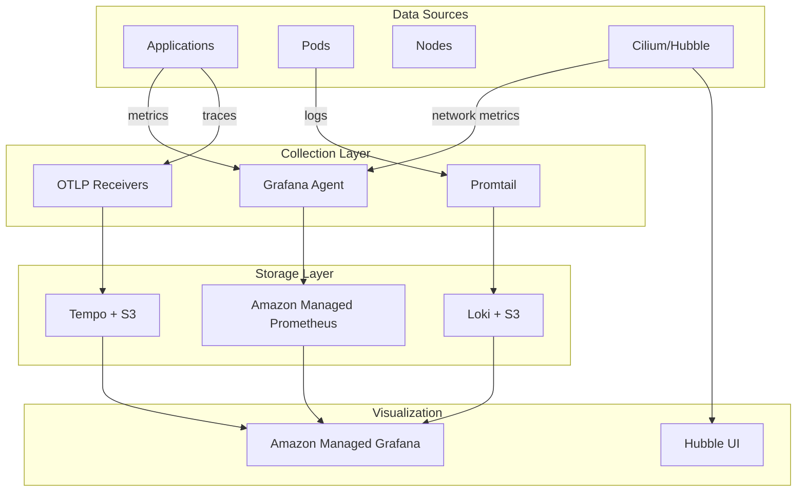
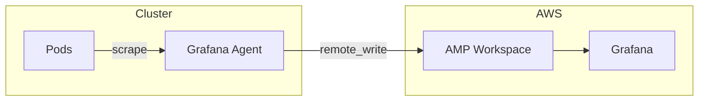
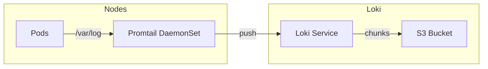
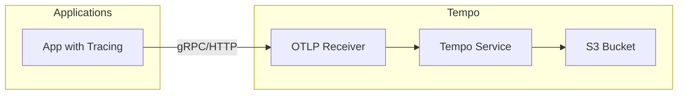
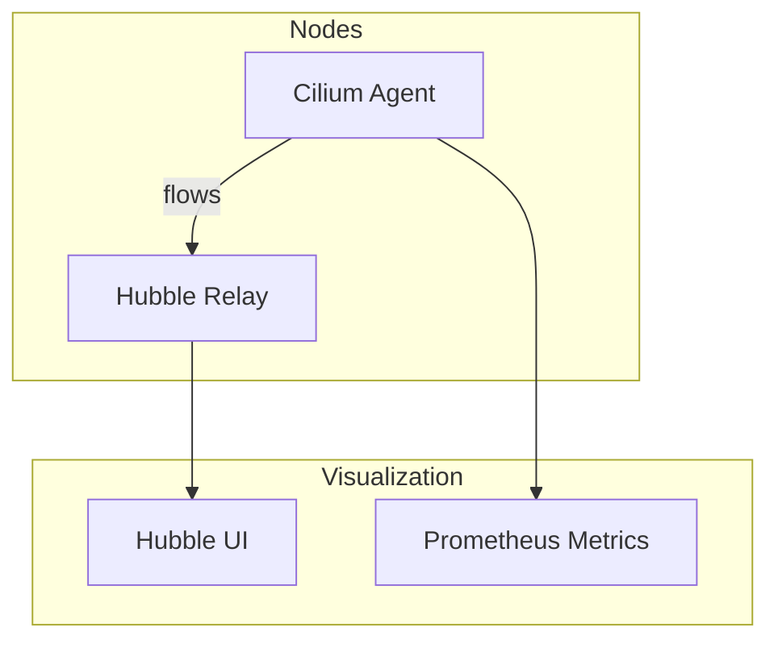

# Observability Architecture

This document describes the observability stack for monitoring, logging, and tracing.

## Overview



## Metrics - Amazon Managed Prometheus

### Architecture



### Grafana Agent Configuration

The Grafana Agent operates in Flow mode for flexible configuration:

```river
// Prometheus scraping
prometheus.scrape "pods" {
  targets    = discovery.kubernetes.pods.targets
  forward_to = [prometheus.remote_write.amp.receiver]
}

prometheus.scrape "services" {
  targets    = discovery.kubernetes.services.targets
  forward_to = [prometheus.remote_write.amp.receiver]
}

// Hubble metrics (from Cilium)
prometheus.scrape "hubble" {
  targets = [{
    __address__ = "hubble-metrics.kube-system.svc.cluster.local:9965",
  }]
  forward_to = [prometheus.remote_write.amp.receiver]
}

// Remote write to AMP
prometheus.remote_write "amp" {
  endpoint {
    url = "https://aps-workspaces.{region}.amazonaws.com/workspaces/{id}/api/v1/remote_write"
    sigv4 {
      region = "{region}"
    }
  }
}
```

### IRSA Permissions

```yaml
ServiceAccount: grafana-agent
Namespace: monitoring
Permissions:
  - aps:RemoteWrite
  - aps:GetSeries
  - aps:GetLabels
  - aps:GetMetricMetadata
```

### Collected Metrics

| Source | Metrics |
|--------|---------|
| Kubernetes | Pod CPU/memory, node resources, API server |
| Cilium | Network flows, DNS, drops, TCP connections |
| Hubble | HTTP latency, request counts, error rates |
| Applications | Custom application metrics (via scrape) |

## Logs - Loki

### Architecture



### Promtail Configuration

Promtail runs as a DaemonSet on all nodes:

```yaml
config:
  clients:
    - url: http://loki:3100/loki/api/v1/push

  snippets:
    pipelineStages:
      - cri: {}  # Parse CRI log format
      - multiline:
          firstline: '^\d{4}-\d{2}-\d{2}|^\[\d{4}'
          max_wait_time: 3s

    extraRelabelConfigs:
      - action: replace
        source_labels: [__meta_kubernetes_pod_node_name]
        target_label: node
      - action: replace
        source_labels: [__meta_kubernetes_namespace]
        target_label: namespace
      - action: replace
        source_labels: [__meta_kubernetes_pod_name]
        target_label: pod
      - action: replace
        source_labels: [__meta_kubernetes_container_name]
        target_label: container
```

### Loki Storage

- **Backend**: S3
- **Bucket naming**: `{env}-{cluster}-loki-{account-id}`
- **Retention**: Configurable (default 30 days)
- **Lifecycle**: Auto-delete after retention period

### IRSA Permissions

```yaml
ServiceAccount: loki
Namespace: monitoring
Permissions:
  - s3:GetObject
  - s3:PutObject
  - s3:DeleteObject
  - s3:ListBucket
```

### Log Labels

Standard labels attached to all logs:

| Label | Source |
|-------|--------|
| `node` | Kubernetes node name |
| `namespace` | Kubernetes namespace |
| `pod` | Pod name |
| `container` | Container name |

## Traces - Tempo

### Architecture



### Trace Receivers

Tempo accepts traces via OTLP:

```yaml
traces:
  otlp:
    grpc:
      enabled: true
      endpoint: 0.0.0.0:4317
    http:
      enabled: true
      endpoint: 0.0.0.0:4318
```

### Storage Configuration

```yaml
storage:
  trace:
    backend: s3
    s3:
      bucket: {env}-{cluster}-tempo-{account-id}
      endpoint: s3.{region}.amazonaws.com
      region: {region}
```

### IRSA Permissions

```yaml
ServiceAccount: tempo
Namespace: monitoring
Permissions:
  - s3:GetObject
  - s3:PutObject
  - s3:DeleteObject
  - s3:ListBucket
```

### Instrumentation

Applications should use OpenTelemetry SDK:

```go
// Example: Go application
import "go.opentelemetry.io/otel"

tracer := otel.Tracer("my-service")
ctx, span := tracer.Start(ctx, "operation-name")
defer span.End()
```

## Network Observability - Hubble

### Architecture



### Hubble Metrics

Collected network metrics:

| Metric Type | Data |
|-------------|------|
| `dns` | Query types, response codes, latency |
| `drop` | Drop reasons, source/destination |
| `tcp` | Connection states, retransmissions |
| `flow` | Flow counts by direction |
| `port-distribution` | Port usage patterns |
| `icmp` | ICMP types and codes |
| `httpV2` | HTTP methods, status codes, latency |

### Hubble UI

When `features.hubbleUi: true`, provides:

- Visual service map
- Real-time flow graph
- Network policy visualization
- Flow filtering and search

## Grafana Dashboards

### Standard Dashboards

The infrastructure deploys standard dashboards:

| Dashboard | Metrics Source | Description |
|-----------|---------------|-------------|
| Cluster Overview | AMP | Cluster health, node status |
| Node Health | AMP | Node CPU, memory, disk |
| Pod Metrics | AMP | Pod resources, restarts |
| Network Flows | Hubble | Service connectivity |

### Dashboard Deployment

```typescript
new StandardDashboards(this, 'StandardDashboards', {
  cluster,
  namespace: 'monitoring',
  clusterOverview: true,
  nodeHealth: true,
  podMetrics: true,
  networkFlows: config.features.hubbleUi,
});
```

## Retention Policies

| Data Type | Dev | Staging | Production |
|-----------|-----|---------|------------|
| Metrics (AMP) | 15 days | 30 days | 90 days |
| Logs (Loki) | 7 days | 30 days | 30 days |
| Traces (Tempo) | 3 days | 7 days | 7 days |

Configured via `observability` config:

```typescript
observability: {
  lokiRetentionDays: 30,
  tempoRetentionDays: 7,
  containerInsights: true,
}
```

## Component Scaling

| Component | Dev | Staging | Production |
|-----------|-----|---------|------------|
| Grafana Agent | 1 | 1 | 1 |
| Loki | 1 | 1 | 3 |
| Tempo | 1 | 1 | 1 |
| Promtail | DaemonSet | DaemonSet | DaemonSet |

## Resource Requirements

### Promtail

```yaml
resources:
  requests:
    cpu: 50m
    memory: 64Mi
  limits:
    cpu: 200m
    memory: 128Mi
```

### Grafana Agent

Runs on system nodes with `CriticalAddonsOnly` toleration.

### Loki/Tempo

Run on system nodes, scale based on data volume.

## Integration with External Systems

### Amazon Managed Grafana

Connect AMG to data sources:

1. AMP for metrics
2. Loki for logs (via Grafana data source)
3. Tempo for traces (via Grafana data source)

### Alerting

Configure alerts in Grafana or use AMP Alertmanager:

```yaml
# Example: High error rate alert
groups:
- name: application
  rules:
  - alert: HighErrorRate
    expr: rate(http_requests_total{status=~"5.."}[5m]) > 0.1
    for: 5m
    labels:
      severity: critical
    annotations:
      summary: High error rate detected
```

## Related Documentation

- [Architecture Overview](./overview.md)
- [Networking Architecture](./networking.md)
- [Security Architecture](./security.md)
