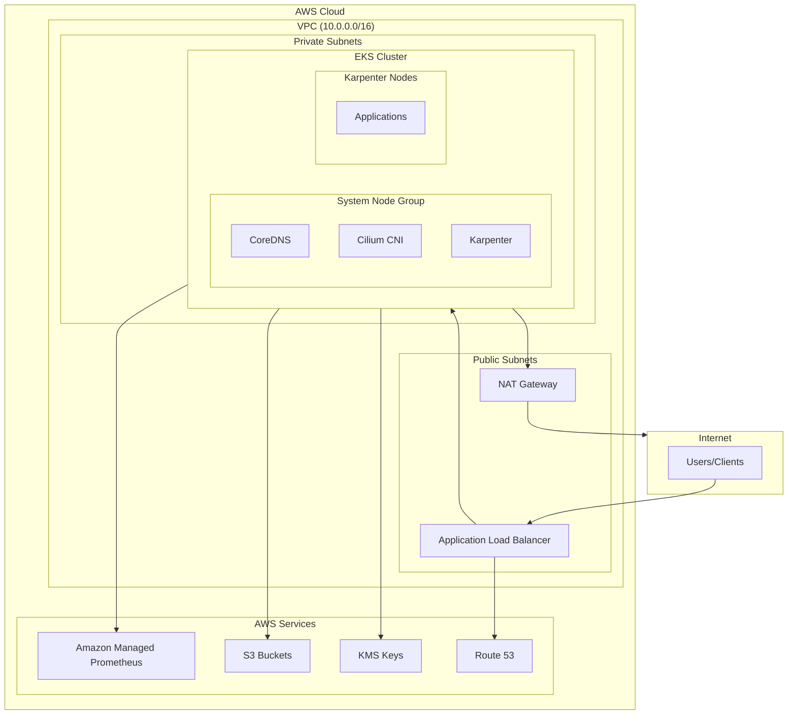
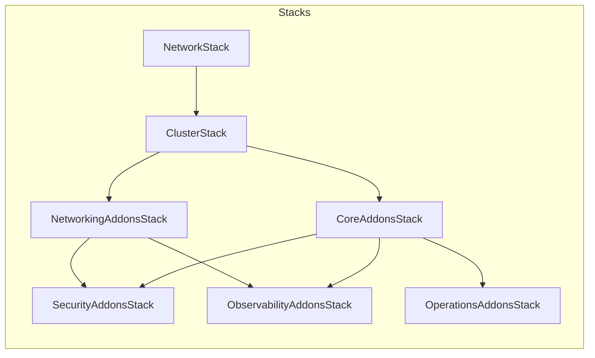

# Architecture Overview

This document provides a comprehensive overview of the AWS EKS infrastructure architecture.

## High-Level Architecture



## Stack Architecture

The infrastructure is organized into modular CDK stacks:

| Stack | Purpose | Key Resources |
|-------|---------|---------------|
| `NetworkStack` | VPC and networking | VPC, Subnets, NAT Gateways, Flow Logs |
| `ClusterStack` | EKS cluster | EKS Cluster, System Node Group, KMS Key |
| `CoreAddonsStack` | Core components | cert-manager, external-secrets, reloader |
| `NetworkingAddonsStack` | Network layer | Cilium, ALB Controller, External DNS |
| `SecurityAddonsStack` | Security tools | Falco, Trivy, Kyverno |
| `ObservabilityAddonsStack` | Monitoring | AMP, Loki, Tempo, Grafana Agent |
| `OperationsAddonsStack` | Operations | Karpenter, Velero, Goldilocks |

## Component Relationships



## Node Architecture

### System Node Group

Managed by AWS EKS, runs critical system components:

- **Capacity Type**: On-Demand only (high availability)
- **Instance Types**: m5a.large, m5.large
- **Min/Max/Desired**: 2/6/2
- **AMI**: Bottlerocket (hardened, minimal attack surface)
- **Labels**: `node-role=system`, `karpenter.sh/do-not-disrupt=true`
- **Taints**: `CriticalAddonsOnly=true:PreferNoSchedule`

**Components running on system nodes:**
- CoreDNS
- Cilium agent and operator
- Karpenter controller
- Metrics Server
- cert-manager
- Security tools (Falco, Kyverno)

### Karpenter Nodes

Dynamically provisioned for workload pods:

- **Capacity Types**: Spot + On-Demand (cost optimization)
- **Instance Categories**: m (general), c (compute), r (memory)
- **Instance Sizes**: medium, large, xlarge, 2xlarge
- **AMI**: Bottlerocket
- **Consolidation**: WhenEmptyOrUnderutilized after 1m

## Data Flow

### Ingress Traffic Flow

```
Internet
    │
    ▼
AWS WAF (optional)
    │
    ▼
Application Load Balancer
    │
    ▼
Cilium (L7 load balancing)
    │
    ▼
Pod
```

### Egress Traffic Flow

```
Pod
    │
    ▼
Cilium (Network Policies)
    │
    ▼
NAT Gateway
    │
    ▼
Internet
```

### Observability Data Flow

```
Application Pods
    │
    ├──[metrics]──► Grafana Agent ──► AMP
    │
    ├──[logs]──► Promtail ──► Loki ──► S3
    │
    └──[traces]──► OTLP ──► Tempo ──► S3
```

## Configuration System

### Environment-Based Configuration

All environments share a base configuration with environment-specific overrides:

```
config/
├── base.ts        # Shared defaults
├── dev.ts         # Development (cost-optimized)
├── staging.ts     # Staging (production-like)
└── production.ts  # Production (full security)
```

### Feature Flags

| Flag | Dev | Staging | Production | Description |
|------|-----|---------|------------|-------------|
| `multiAzNat` | ❌ | ✅ | ✅ | Multi-AZ NAT gateways |
| `hubbleUi` | ✅ | ✅ | ✅ | Network observability UI |
| `falcoKillMode` | ❌ | ❌ | ✅ | Auto-terminate suspicious pods |
| `trivyAdmission` | ❌ | ✅ | ✅ | Block vulnerable images |
| `veleroBackups` | ✅ | ✅ | ✅ | Cluster backups |
| `goldilocks` | ✅ | ✅ | ✅ | Resource recommendations |

## Encryption

### Data at Rest
- **EKS Secrets**: KMS envelope encryption
- **EBS Volumes**: KMS encryption
- **S3 Buckets**: S3-managed encryption
- **etcd**: Encrypted by default (EKS managed)

### Data in Transit
- **Pod-to-Pod**: WireGuard encryption via Cilium mTLS
- **External Traffic**: TLS via ALB/cert-manager
- **AWS API Calls**: HTTPS with SigV4

## High Availability

### Multi-AZ Deployment
- VPC spans 3 Availability Zones
- System nodes distributed across AZs
- Production uses multi-AZ NAT gateways

### Component Redundancy

| Component | Dev | Staging | Production |
|-----------|-----|---------|------------|
| NAT Gateways | 1 | 2+ | 3 |
| System Nodes | 2 | 2 | 2+ |
| Kyverno | 1 | 1 | 3 |
| Loki | 1 | 1 | 3 |
| Falco Talon | - | - | 2 |

## Related Documentation

- [Networking Architecture](./networking.md)
- [Security Architecture](./security.md)
- [Observability Architecture](./observability.md)
