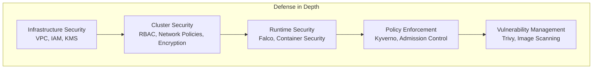
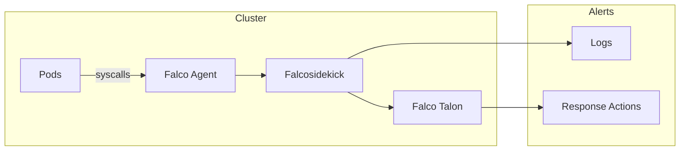
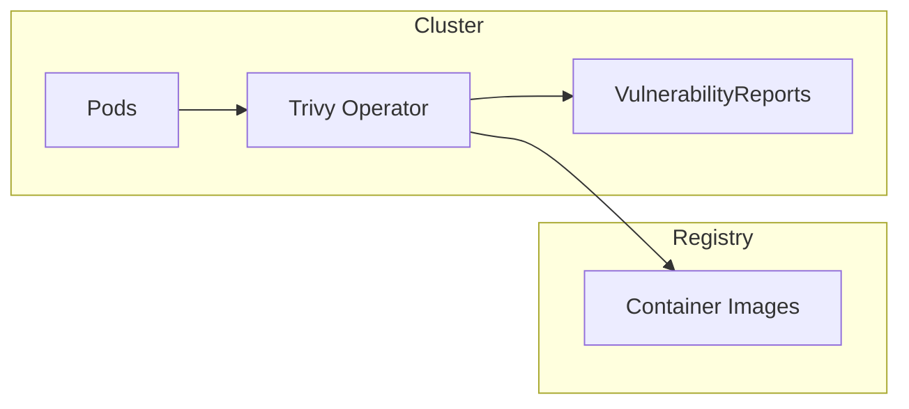
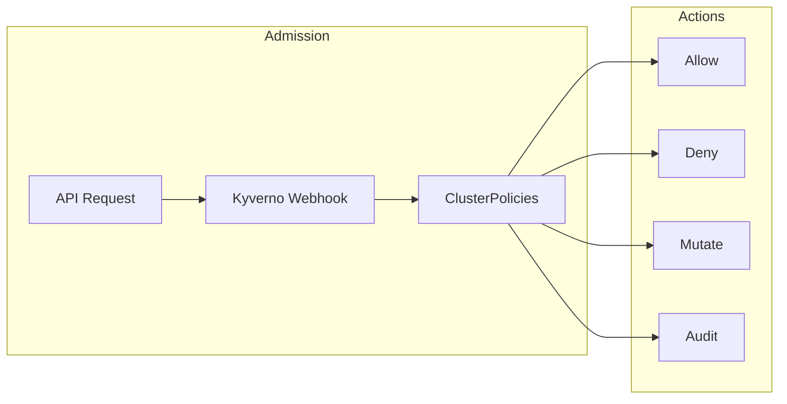
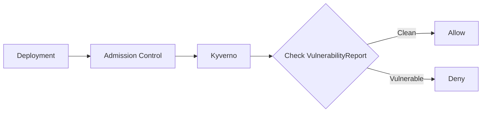
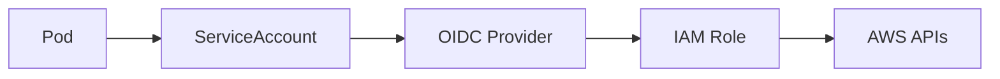

# Security Architecture

This document describes the security architecture and compliance capabilities of the AWS EKS infrastructure.

## Security Layers



## Security Components

### Falco - Runtime Security

Falco monitors system calls and container behavior to detect threats at runtime.



#### Driver Configuration

Uses modern eBPF driver for minimal overhead:

```yaml
driver:
  kind: modern_ebpf
```

#### Detection Rules

Falco detects:
- Container escape attempts
- Privilege escalation
- Suspicious shell execution
- Sensitive file access
- Unexpected network connections
- Cryptomining activity

#### Falco Talon (Kill Mode)

In production with `falcoKillMode: true`, Falco Talon automatically responds to threats:

| Alert | Response |
|-------|----------|
| Container Escape Attempt | Immediate pod termination |
| Shell Spawned in Container | Pod termination (5s grace) |
| Sensitive File Access | Immediate pod termination |
| C2 Server Connection | Network isolation policy |

### Trivy Operator - Vulnerability Scanning

Continuously scans container images for vulnerabilities.



#### Configuration

```yaml
operator:
  scanJobTimeout: 10m
  excludeNamespaces: kube-system,kube-public,trivy-system,falco-system

trivy:
  severity: HIGH  # Configurable threshold
  ignoreUnfixed: true
```

#### Severity Threshold

Configured via `security.trivySeverityThreshold`:
- `CRITICAL` - Only block critical vulnerabilities
- `HIGH` - Block high and critical
- `MEDIUM` - Block medium and above
- `LOW` - Block all vulnerabilities

### Kyverno - Policy Engine

Enforces security policies through admission control.



#### Policy Categories

**Best Practices (Environment-Aware):**
| Policy | Dev | Staging | Production |
|--------|-----|---------|------------|
| Require resource limits | Audit | Audit | Enforce |
| Require standard labels | Audit | Enforce | Enforce |
| Disallow latest tag | Audit | Enforce | Enforce |

**Security Policies (Always Enforce):**
- Disallow privileged containers
- Disallow hostPath volumes
- Disallow host network
- Disallow privilege escalation

**Security Policies (Environment-Aware):**
| Policy | Dev | Staging | Production |
|--------|-----|---------|------------|
| Require runAsNonRoot | Audit | Enforce | Enforce |
| Require readOnlyRootFilesystem | Audit | Audit | Enforce |
| Require drop all capabilities | Audit | Enforce | Enforce |

#### Example Policy: Disallow Privileged

```yaml
apiVersion: kyverno.io/v1
kind: ClusterPolicy
metadata:
  name: disallow-privileged
spec:
  validationFailureAction: Enforce
  rules:
  - name: disallow-privileged-containers
    match:
      any:
      - resources:
          kinds:
          - Pod
    validate:
      message: "Privileged containers are not allowed"
      pattern:
        spec:
          containers:
          - securityContext:
              privileged: "!true"
```

### Trivy + Kyverno Integration

When `trivyAdmission: true`, Kyverno enforces Trivy scan results:



Policy checks that:
1. Image has been scanned by Trivy
2. No vulnerabilities above threshold exist

## IAM Security

### IRSA (IAM Roles for Service Accounts)

All AWS access uses IRSA for fine-grained permissions:



Example IRSA configuration:

```typescript
new IrsaRole(this, 'LokiRole', {
  cluster,
  serviceAccount: 'loki',
  namespace: 'monitoring',
  policyStatements: [
    new iam.PolicyStatement({
      actions: ['s3:GetObject', 's3:PutObject'],
      resources: ['arn:aws:s3:::bucket/*'],
    }),
  ],
});
```

### Karpenter Node Role

Karpenter-provisioned nodes have minimal permissions:

- `AmazonEKSWorkerNodePolicy`
- `AmazonEC2ContainerRegistryReadOnly`
- `AmazonSSMManagedInstanceCore`

## Encryption

### Secrets Encryption

EKS secrets are encrypted with KMS envelope encryption:

```typescript
secretsEncryptionKey: new kms.Key(this, 'SecretsKey', {
  alias: `${clusterName}-secrets`,
  enableKeyRotation: true,
});
```

### Network Encryption

WireGuard mTLS encrypts all pod-to-pod traffic:

```yaml
encryption:
  enabled: true
  type: wireguard
```

### Storage Encryption

- **EBS Volumes**: Encrypted by default (Karpenter EC2NodeClass)
- **S3 Buckets**: S3-managed encryption
- **Backups**: Encrypted at rest

## Compliance

### SOC2

| Control | Implementation |
|---------|----------------|
| Access Control | RBAC, IRSA, AWS SSO |
| Audit Logging | CloudTrail, EKS audit logs |
| Encryption | KMS, WireGuard mTLS |
| Vulnerability Management | Trivy scanning |
| Incident Response | Falco detection |

### HIPAA

| Requirement | Implementation |
|-------------|----------------|
| Encryption at Rest | KMS for secrets, EBS, S3 |
| Encryption in Transit | WireGuard mTLS, TLS |
| Access Logging | CloudTrail, VPC Flow Logs |
| Audit Controls | Kyverno policies |

### PCI-DSS

| Requirement | Implementation |
|-------------|----------------|
| Network Segmentation | Cilium network policies |
| Vulnerability Scanning | Trivy operator |
| Security Monitoring | Falco runtime detection |
| Access Control | RBAC, network policies |

## Security Best Practices

### Container Security

1. **Use minimal base images**: Bottlerocket for nodes
2. **Run as non-root**: Enforced by Kyverno
3. **Read-only filesystem**: Enforced in production
4. **Drop all capabilities**: Enforced by Kyverno

### Network Security

1. **Default deny policies**: Implement per namespace
2. **Encrypted traffic**: WireGuard mTLS
3. **Private subnets**: All workloads in private subnets
4. **No public IPs**: Pods don't get public IPs

### Secret Management

1. **External secrets**: Use external-secrets operator
2. **No secrets in code**: Use ExternalSecret resources
3. **Rotation**: Enable secret rotation in AWS

## Excluded Namespaces

System namespaces excluded from policy enforcement:

```typescript
DEFAULT_EXCLUDED_NAMESPACES = [
  'kube-system',
  'kube-public',
  'kube-node-lease',
  'default',
];

SECURITY_NAMESPACES = [
  'falco-system',
  'trivy-system',
  'kyverno',
  'cilium-system',
];
```

## Related Documentation

- [Architecture Overview](./overview.md)
- [Networking Architecture](./networking.md)
- [Observability Architecture](./observability.md)
